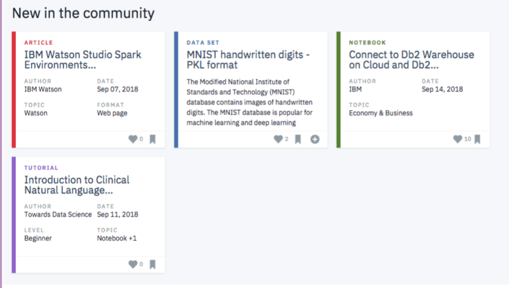

# Recommendation-engine-with-IBM
A part of Data Scientist Nanodegree project.

# Installation 
- Anaconda disrtbution with python vesion of 3^ will suffice.

# Introduction 
For this project i will analyze the interactions that users have with articles on the IBM Watson Studio platform, and make recommendations to them about new articles you think they will like. Below you can see an example of what the dashboard could look like displaying articles on the IBM Watson Platform.

